# TypeScript to Native Machine Code

## Proposal

This document proposes a native compiler pipeline for TypeScript that reuses the
front end of [TypeScript-Go](https://github.com/microsoft/typescript-go) and adds
a typed intermediate representation (IR) plus native code-generation backends.

The goal is to compile a well-defined, ahead-of-time (AOT) subset of TypeScript
into a native executable while preserving TypeScript's familiar syntax and type
checking model.

This is an architectural proposal, not a claim that TypeScript-Go already emits
LLVM IR, C, or machine code. TypeScript-Go is the starting point for parsing,
binding, module resolution, and type checking. The lowering, runtime, and native
backends described below are additional components.

## Design Goals

- Reuse TypeScript's existing parser and type system instead of defining a
  second language front end.
- Preserve JavaScript-compatible behavior where the selected compilation mode
  requires it.
- Make runtime and ABI choices explicit. Native compilation cannot silently
  assume that JavaScript objects behave like C structs.
- Support two interchangeable backend paths: LLVM IR for optimization and C for
  portability and a simple bootstrap path.
- Produce useful diagnostics at the original TypeScript source locations.
- Start with a small, predictable AOT subset and expand it incrementally.

## Non-Goals

- Replacing the JavaScript/Node.js execution model for every existing package.
- Making all dynamic JavaScript features zero-cost in native code.
- Guaranteeing that native output has identical performance characteristics to
  JavaScript output.
- Treating TypeScript annotations as runtime validation. Erased annotations are
  compile-time information only unless a runtime representation is requested.

## High-Level Pipeline

```text
TypeScript source
       |
       v
TypeScript-Go front end
       |
       | parse, bind, resolve, typecheck
       v
Native adapter + lowering
       |
       v
Typed IR
   |        |
   v        v
LLVM IR    C code
   |        |
   +----+---+
        v
      clang
        |
        v
   Object files --------------+
                              |
  Native runtime -------------+--> Linker
                                    |
                                    v
                             Native executable
```



```mermaid
flowchart LR
    subgraph Input[Project input]
        SRC[TypeScript entry point<br/>and local source files]
        CFG[Compiler options<br/>target, backend, debug, mode]
    end

    subgraph Frontend[TypeScript-Go front end]
        PARSE[Parse<br/>source text -> AST]
        BIND[Bind and scope analysis<br/>AST -> symbols]
        RESOLVE[Resolve imports<br/>symbols -> closed module graph]
        CHECK[Type check and control-flow analysis<br/>types, narrowing, diagnostics]
        ADAPTER[Native adapter<br/>normalize checked program]
    end

    subgraph Gate[Native subset gate]
        FEATURES[Feature matrix and representation policy]
        ERRORS{Blocking<br/>diagnostics?}
    end

    subgraph Middle[Backend-independent middle end]
        LOWER[Lower checked AST<br/>make conversions, checks, runtime calls explicit]
        VERIFY[Verify and optionally optimize<br/>Typed IR]
        TIR[Typed IR module<br/>instructions + types + source spans]
    end

    subgraph Backend[Selected native backend]
        SELECT{Backend}
        LLVM[LLVM code generator<br/>Typed IR -> LLVM IR]
        CGEN[C code generator<br/>Typed IR -> generated C]
    end

    subgraph Toolchain[Native toolchain]
        CLANG[clang<br/>compile, optimize, target]
        LINK[Link object files<br/>with runtime and platform libraries]
        EXE[Native executable]
    end

    RUNTIME[Versioned native runtime<br/>memory, strings, objects, arrays,<br/>exceptions, console, startup]
    ABI[Runtime ABI and object layout<br/>calling convention, ownership, values]
    DEBUG[Debug and diagnostic artifacts<br/>source maps, IR dumps, debug info]
    FAIL[Actionable compiler diagnostic]

    SRC --> PARSE
    CFG --> PARSE
    PARSE --> BIND --> RESOLVE --> CHECK --> ADAPTER
    CFG --> ADAPTER
    ADAPTER --> FEATURES
    FEATURES --> ERRORS
    ERRORS -- yes --> FAIL
    ERRORS -- no --> LOWER
    LOWER --> VERIFY --> TIR
    ABI --> LOWER
    ABI --> TIR
    TIR --> SELECT
    SELECT -- LLVM --> LLVM --> CLANG
    SELECT -- C (deferred) --> CGEN --> CLANG
    RUNTIME --> LINK
    CLANG --> LINK --> EXE
    CHECK -. source spans .-> DEBUG
    TIR -. IR metadata .-> DEBUG
    LLVM -. debug locations .-> DEBUG
    CGEN -. generated-source mapping .-> DEBUG

    classDef input fill:#e8f1f2,stroke:#24545a,color:#102a2d
    classDef stage fill:#f6f0df,stroke:#8b6f2f,color:#2e2613
    classDef decision fill:#f8e1d5,stroke:#a34c2f,color:#3b1b12
    classDef artifact fill:#e6edf8,stroke:#345b91,color:#17253b
    classDef runtime fill:#e8e4f4,stroke:#66518f,color:#241b3d
    classDef output fill:#dcefdc,stroke:#39733d,color:#163919
    classDef error fill:#f5dddd,stroke:#a33f3f,color:#451616

    class SRC,CFG input
    class PARSE,BIND,RESOLVE,CHECK,ADAPTER,LOWER,VERIFY,CLANG,LINK stage
    class FEATURES,ERRORS,SELECT decision
    class TIR,LLVM,CGEN,DEBUG artifact
    class ABI,RUNTIME runtime
    class EXE output
    class FAIL error
```

The data path is intentionally separated from the control and support paths:

```text
source + options
    -> parsed AST
    -> bound symbols + resolved module graph
    -> checked program + diagnostics
    -> native subset gate
    -> lowered Typed IR
    -> selected backend (LLVM or deferred C)
    -> clang and linker
    -> executable

runtime ABI + object model --------------------^  (used by lowering and linking)
source spans + IR metadata ---------------------> diagnostics, debug info, IR dumps
blocking diagnostics ----------------------------> stop before code generation
```

The important artifacts at each boundary are:

| Boundary | Artifact | Purpose |
| --- | --- | --- |
| Front end -> adapter | Checked program | Source files, resolved modules, symbols, types, options, diagnostics, and spans |
| Adapter -> lowering | Native compilation input | A normalized view of the TypeScript-Go results plus the supported-feature policy |
| Lowering -> backend | Typed IR module | Explicit values, conversions, runtime checks, calls, control flow, types, and source locations |
| Backend -> toolchain | LLVM IR or generated C | Target-specific code-generation input with runtime ABI calls |
| Toolchain -> user | Executable and debug artifacts | Native binary, diagnostics, source mapping, and optional intermediate dumps |

Compilation stops at the subset gate when diagnostics make native lowering
unsafe. Diagnostics that arise during lowering must still point back to the
original TypeScript span rather than surfacing later as an opaque backend or
linker failure.

The LLVM and C paths are alternative backends. They should consume the same
Typed IR and share the same runtime and ABI definitions. `clang` can consume
LLVM IR directly or compile generated C, so it is the common toolchain boundary
in this proposal. LLVM is the primary backend for the initial implementation
because it provides the strongest path to optimization, target selection, and
debug information. The C backend remains a deferred portability and bootstrap
backend that can be added after the LLVM path is stable.

## Compiler Stages

### 1. TypeScript-Go Front End

The front end is responsible for the language-facing work:

- lexical and syntactic parsing;
- AST construction;
- symbol binding and scope analysis;
- module resolution and dependency discovery;
- type checking and diagnostics;
- control-flow and narrowing information where available;
- source maps and source-location tracking.

The native pipeline should consume the front end's public or explicitly exposed
compiler data rather than reimplementing TypeScript semantics. A thin adapter
normalizes those results into a native compilation input:

```text
Program
  - source files
  - resolved modules
  - compiler options
  - diagnostics
  - symbols and types
  - source locations
```

Compilation must stop, or switch to an explicitly dynamic mode, when type
checking produces errors that affect native lowering.

### 2. Lowering

Lowering converts the TypeScript AST and checked type information into Typed IR.
This is where source-level constructs become explicit runtime operations.

Examples:

| TypeScript | Typed IR direction |
| --- | --- |
| `let x = 1` | Create an `i32` or configured integer value and bind `x` |
| `a + b` | Emit a typed numeric add or a runtime numeric operation |
| `obj.field` | Emit a field load if the object layout is static, otherwise a runtime lookup |
| `if (value)` | Emit a truthiness conversion followed by a conditional branch |
| `function f(x: number)` | Emit a function with a declared native signature |
| `await task` | Reject in the first synchronous MVP or lower to an explicit async state machine |

Lowering should retain source spans on every instruction that can produce a
diagnostic. It should also make implicit JavaScript behavior visible, including
boxing, null checks, conversions, bounds checks, and calls into the runtime.

### 3. Typed IR

Typed IR is the stable contract between TypeScript semantics and native
backends. It should be language-aware enough to preserve behavior but low-level
enough that LLVM and C generation are mechanical.

A minimal initial instruction set might include:

- primitive constants: boolean, integer, floating-point, string, null, and
  undefined;
- local allocation, load, store, and SSA-like values;
- arithmetic and comparison operations;
- branches, loops, and return values;
- statically typed function calls;
- object and array allocation;
- field and element access;
- tagged-union checks and discriminant extraction;
- explicit conversions and runtime calls;
- exceptions or a defined error-result convention;
- debug locations and module metadata.

Every value should have an IR type and a representation policy. A useful first
set of representations is:

```text
bool       -> i1
number     -> f64 by default, with an opt-in integer subset
bigint     -> runtime-managed bigint value
string     -> runtime string handle
object     -> runtime object pointer or a static native layout
array      -> runtime array pointer with element metadata
null       -> null reference / tagged value
undefined  -> dedicated tagged value
```

The representation of `number` is an important compatibility decision. Native
integer arithmetic is attractive for systems code, but JavaScript numbers are
IEEE-754 doubles and have different overflow and conversion behavior. The MVP
should use `f64` for ordinary `number` and introduce explicit integer types or
validated integer lowering later.

## Runtime and Object Model

Native code still needs a runtime for features that are not directly expressible
as machine instructions. The runtime should be a small, versioned library linked
into the executable.

Initial runtime responsibilities:

- allocation and deallocation or garbage collection;
- strings and UTF-16/UTF-8 conversion policy;
- arrays and bounds checking;
- object headers, hidden type information, and property access;
- `null`, `undefined`, and truthiness behavior;
- exceptions and stack unwinding policy;
- standard library functions selected for the AOT target;
- process startup and command-line argument conversion.

The compiler should distinguish two object modes:

1. **Static layout mode:** classes and object shapes proven stable by the type
   checker use native fields and direct loads/stores.
2. **Dynamic compatibility mode:** objects that need arbitrary properties,
   prototype behavior, or reflective access use runtime-managed objects.

This split allows performance work without pretending that every TypeScript
object is a C struct.

## Primary Backend: LLVM IR

The LLVM backend lowers Typed IR into LLVM IR and invokes the target toolchain.
LLVM is the preferred backend for the first implementation because it provides:

- mature optimization passes;
- multiple CPU and operating-system targets;
- debug information generation;
- sanitizers and profiling integrations;
- established object-file and linker support.

The backend must define stable mappings for calling conventions, aggregate
returns, alignment, pointer ownership, exception handling, and runtime calls.
Typed IR optimizations should remain target-independent. Target-specific work,
such as vectorization or register-sensitive tuning, belongs in LLVM where
possible.

## Deferred Backend: C

The C backend emits portable C that represents the same Typed IR operations and
calls the native runtime. `clang` then compiles and links the generated C:

```text
Typed IR -> generated C -> clang -> object files -> linker -> executable
```

The C backend is deferred until the LLVM backend and runtime ABI are stable. It
will later provide an inspectable bootstrap path and improve portability to
toolchains where LLVM is not available. It should avoid depending on undefined
C behavior and use explicit helper functions for overflow, tagged values,
allocation, and exception paths.

The C backend is not merely a pretty-printer. It must implement the same
semantics as the LLVM backend, including evaluation order and runtime checks.

## Modules, Packages, and the Standard Library

Native compilation needs a closed module graph. The compiler should resolve the
program entry point and classify imports into:

- **AOT modules:** compiled into Typed IR and linked into the executable;
- **runtime modules:** implemented by the native runtime;
- **unsupported modules:** rejected with an actionable diagnostic;
- **foreign modules:** explicitly declared native or C/LLVM bindings.

The first release should support local TypeScript modules and a small standard
library surface. Full npm compatibility is a separate project because many npm
packages depend on dynamic loading, Node.js APIs, eval, browser globals, or
JavaScript-specific packaging behavior.

## Errors, Diagnostics, and Debugging

Diagnostics should remain anchored to TypeScript source locations across every
stage:

```text
TypeScript source span
        |
        v
Typed IR instruction metadata
        |
        v
LLVM debug location / generated C comment
        |
        v
Native stack trace and debugger location
```

The compiler should report unsupported constructs during lowering, not as an
opaque linker failure. Each diagnostic should include the construct, why the
selected target cannot represent it, and a supported alternative when one is
available.

## Suggested CLI Shape

The exact command name is intentionally left open, but the interface should
make the stages observable:

```text
ts-native check   src/main.ts
ts-native lower   src/main.ts --emit typed-ir
ts-native build   src/main.ts --backend llvm --target x86_64-unknown-linux-gnu
ts-native build   src/main.ts --backend c --target native   # deferred backend
```

Useful output modes include:

- `--emit ast` for the checked front-end view;
- `--emit typed-ir` for backend-independent inspection;
- `--emit llvm-ir` for LLVM debugging;
- `--emit c` for deferred C backend debugging;
- `--print-runtime` for the runtime library and ABI version;
- `--diagnostics` for lowering and representation decisions.

## MVP Scope

The first end-to-end milestone should compile a small synchronous program:

```ts
function add(a: number, b: number): number {
  return a + b;
}

const result = add(20, 22);
console.log(result);
```

Recommended MVP constraints:

- one entry point;
- local modules only;
- synchronous functions;
- primitive booleans, `number`, strings, arrays, and simple classes;
- explicit restrictions on reflection, `eval`, dynamic imports, and prototype mutation;
- `f64` semantics for ordinary `number`;
- LLVM backend first; defer the C backend until LLVM/runtime parity is stable;
- a small native `console.log` implementation;
- deterministic diagnostics for unsupported syntax or APIs.

## Implementation Roadmap

### Phase 1: Front-End Adapter

- Pin a compatible TypeScript-Go revision.
- Define the adapter contract for checked programs, symbols, types, and spans.
- Compile a single source file through parsing and type checking.
- Add a feature matrix for constructs supported by native lowering.

### Phase 2: Typed IR and Interpreter

- Define the IR type and instruction model.
- Implement lowering for literals, locals, arithmetic, functions, branches, and returns.
- Build a small IR interpreter or verifier.
- Add golden tests for source-to-IR output.

### Phase 3: LLVM Backend and Runtime

- Define the runtime ABI and ownership rules.
- Map the initial Typed IR subset to LLVM IR.
- Implement startup, strings, numeric operations, and `console.log`.
- Compile LLVM IR and link the native executable with `clang`.

### Phase 4: C Backend (Deferred)

- Generate C from the same Typed IR and runtime ABI.
- Compare C output against the established LLVM semantic test suite.
- Add the C backend only after backend parity and ABI compatibility are proven.

### Phase 5: Language and Runtime Expansion

- Add object layouts, arrays, exceptions, and selected async lowering.
- Add foreign-function interfaces with explicit declarations.
- Expand standard library coverage by target.
- Add garbage collection or a documented ownership strategy.

## Correctness Strategy

The project should use differential and golden testing:

1. Run a TypeScript test case with the reference JavaScript runtime.
2. Run the same case through the LLVM backend executable.
3. Run it through the C backend executable once that deferred backend exists.
4. Compare observable output, exit status, and defined error behavior.

Tests should cover evaluation order, numeric edge cases, `null` and
`undefined`, string behavior, array bounds, exceptions, module initialization,
and source-level diagnostics. Backend-specific tests should verify ABI details,
while shared semantic tests verify that both backends agree.

## Key Risks

| Risk | Consequence | Mitigation |
| --- | --- | --- |
| JavaScript semantics are more dynamic than native layouts | Incorrect behavior or excessive runtime calls | Start with a documented subset and explicit dynamic fallback |
| `number` differs from native integers | Overflow and comparison bugs | Use `f64` by default; require explicit integer semantics |
| TypeScript types are erased at runtime | Missing checks or invalid assumptions | Add representation metadata only where runtime behavior needs it |
| npm and Node.js compatibility is broad | Scope expands beyond a compiler backend | Require closed modules and target-specific runtime APIs |
| C and LLVM backends diverge | Backend-dependent program behavior | Share Typed IR, ABI, runtime, and differential tests |
| Memory management is underspecified | Leaks, use-after-free, or pauses | Choose ownership, reference counting, or GC before object-heavy features |

## Decisions

- The first native language subset is explicitly strict TypeScript, without
  partial JavaScript compatibility.
- Object values use specialized static layouts.
- Exceptions use native unwinding.
- `async`/`await` is lowered to a state machine.
- The first supported target is macOS ARM64 with LLVM/Clang 18.

## Summary

`typescript-go` can provide the language front end for a native TypeScript
compiler. The central engineering boundary is Typed IR: it preserves the
meaning discovered by parsing and type checking while exposing enough runtime
detail for multiple backends. LLVM should be implemented first because it gives
the initial compiler a direct path to optimization, debugging, and native
targets. A C backend can follow as a deferred portability and bootstrap option.
The project should grow from a small, tested synchronous subset with an
explicit runtime rather than attempting full JavaScript compatibility in the
first release.
